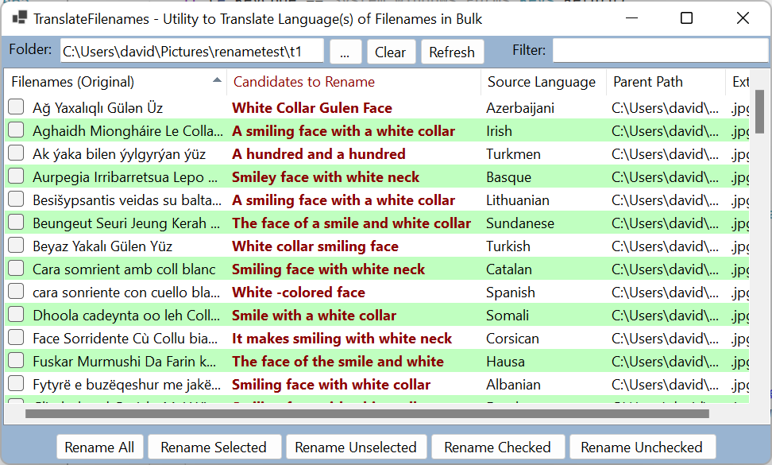
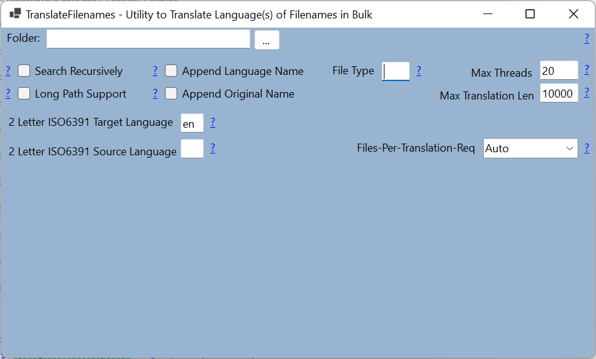

# Translate File Names
Includes both a windows GUI and a command line utility to translate and rename files from their source language to the set language. By default, the set language is the local system TwoLetterISOLanguageName.

## What does it do?

The program renames all the files from their source language to the specified target language (default: locale).

Example use-case:
	Translate foreign movie *.mp4 file names.
	Translate names of songs ripped from an imported foreign album.

# Content

[Features](README.md#Features)
-  [Translates all file names in folder](README.md#Translates-all-file-names-in-folder)
-  [Modify translated name](README.md#Modify-translated-name)
-  [Search Recursively](README.md#Search-Recursively)
-  [Long Path Support](README.md#Long-Path-Support)
-  [Append Original Name](README.md#Append-Original-Name)
-  [Append Language Name](README.md#Append-Language-Name)
-  [File Type](README.md#File-Type)
-  [Max Threads](README.md#Max-Threads)
-  [Max Translation Len](README.md#Max-Translation-Len)
-  [Files-Per-Translation-Req](README.md#Files-Per-Translation-Req)
-  [Target Language](README.md#Target-Language)
-  [Source Language](README.md#Source-Language)
-  [Filter](README.md#Filter)
-  
[Console Program](README.md#Console-Program)

[Author](README.md#Author)

[License](README.md#License)

## Features

#### Translates all file names in folder

Scans all files in selected folder, and only displays files having names in different language from the targetted language.

File renaming does not occur untill one of the following options is selected.
-  [Rename All]

		Renames all files displayed on the list.

-  [Rename Selectedl]

		Renames only selected files on the list.

-  [Rename Unselected]

		Renames only files that are not selected.

-  [Rename Checked]
	
		Renames only files that have been checked.

-  [Rename Unchecked]
	
		Renames only files which have not been checked.

#### Filter

This option allows user to use keywords to find or filter the list to only items having the keyword(s).

When this option is used, and the "Rename All" option is selected, only the resulting filtered items displayed are renamed.

#### Modify translated name

The translated name on the list, can be edited before performing the rename action.

#### Search Recursively

By default, only the files on the root directory are scanned, but by selecting this option, the scan will also search all sub folders.

#### Long Path Support

By selecting this option, the rename will occur even if the full path is longer then 255 characters.

#### Append Original Name 

When selected, this options includes the original file name when renaming the file.  Example: TranslatedName(OriginalName).gif

#### Append Language Name

When selected, appends the source language name to the renamed file. Example: TranslatedName_[Russian].gif

#### File Type

This option can be used to scan only file a specific file extension. Example: .gif

#### Max Threads

By default the programs uses the ProcessorCount to determine the maximum threads to use.  This options allows the end user to override that option.  The minimum value is 4, and the maximum value is 400.

#### Max Translation Len

The translation length is used when the program translates many files in a single translation request.  This happens if there are many files (over 100), or if the user selects option to translate many files per request.

This value is set to 10000 by default.  The minimum value is 255, and the maximum value is 10,000.

#### Files-Per-Translation-Req

This options determines if one file is used per translation request, or if many files are used per translation request. The following are the possible options to select from the combobox window.

-  [Auto]

		This is the default option. It automatically sets the best method depending on the totoal number of files to check for translation and the maximum thread settings.

-  [OnePerFile]

		Only one file is sent per translation request. This is the preferred option if the files have different languages.

-  [Many]

		Multiple files are sent per translation request. This is the perferred option if the files are all in either the source language or the target language.

#### Target Language

This setting is an [ISO 639-1](https://wikipedia.org/wiki/List_of_ISO_639-1_codes) two letter code.
By default, the target language is set to the operating system language settings. (CurrentCulture.TwoLetterISOLanguageName)

Use this option to override the target language.  See [ISO 639-1](https://wikipedia.org/wiki/List_of_ISO_639-1_codes) link to get desired language code.

#### Source Language

This is empty by default. When this value is empty, the translation works in "Auto" mode, which lets the translator determine the source language.

For most use cases, this value should be left empty.  If populated, use [ISO 639-1](https://wikipedia.org/wiki/List_of_ISO_639-1_codes) link to get desired language code.

#### Sortable File List

The list view has multiple columns, and the list can be sorted by any column by clicking on the column header.

## Option Window Screenshot

# Console Program

#### Command Line Example Usage:

-  TranslateFileNames -r

-  TranslateFileNames "C:\Users\jane-doe\Pictures" -r -ext *.jpg

# Author

* **David Maisonave** - [David-Maisonave](https://github.com/David-Maisonave)

# License

-  This project is licensed under the MIT License - see the [LICENSE](LICENSE) file for details.
